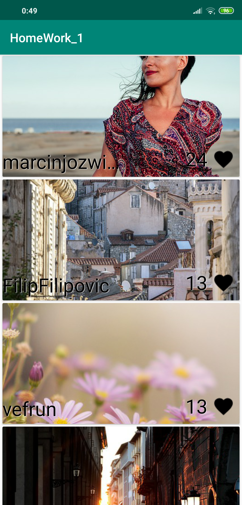
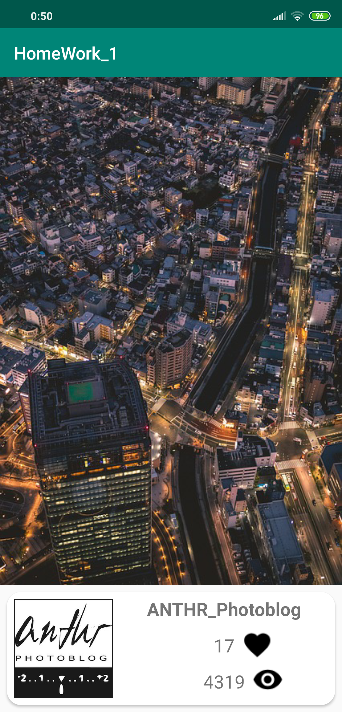

# OtusHomeWork_1
Домашнее задание  по работе с публичным API на Kotlin
# Используемое API
[Pixabay.com](https://pixabay.com/api/docs/)
# Используемые технологии
Kotlin, Dagger 2, Picasso, Retrofit 2.
# Вид приложения

